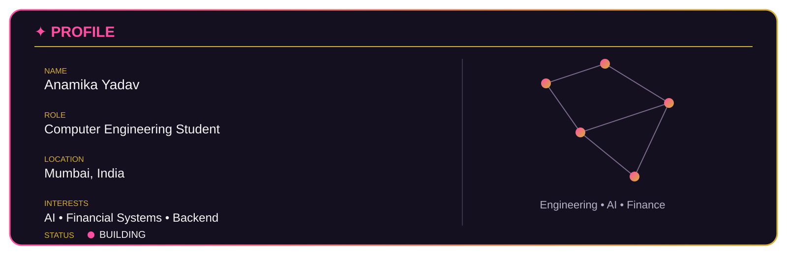
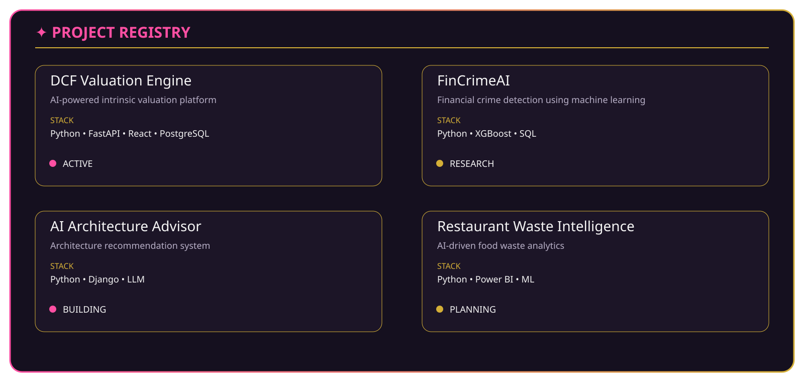

  

  

  

## 🌸 About Me

I'm a Computer Engineering student passionate about building software that solves real-world problems.

My interests currently revolve around:

- 🧠 Artificial Intelligence & Machine Learning
- ⚙️ Backend Engineering
- 💹 Financial Technology
- 🔬 Applied Research
- 📊 Data Analytics

I enjoy understanding complex systems, breaking them down, and rebuilding them into practical, scalable solutions.

---

## ⚡ Tech Stack

### Languages

### Frameworks & Libraries

### Tools

---

## 🚀 Currently Working On

- 🤖 AI-powered Financial Systems
- 📈 Intelligent Valuation & Analytics
- ⚙️ Backend Development
- 📚 Strengthening DSA & System Design
- 💻 Building production-ready projects

---

## 🐍 Contribution Snake

---

## 🌐 Connect With Me

---

### Thanks for stopping by!

⭐ *Always learning. Always building.*

